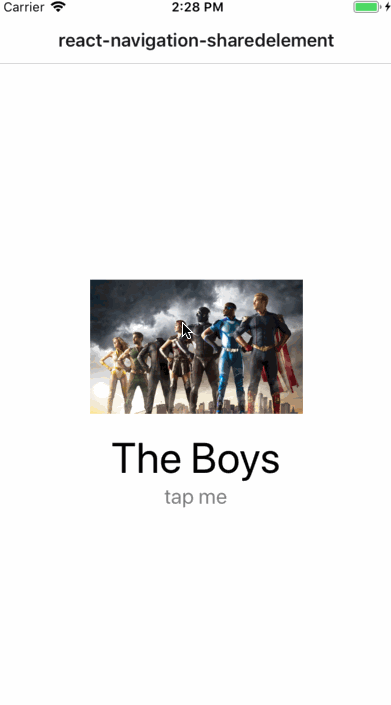

# react-navigation-shared-element-rn60demo

A simple app that demonstrates how to use [react-native-shared-element](https://github.com/IjzerenHein/react-native-shared-element) and [React Navigation binding](https://github.com/IjzerenHein/react-navigation-shared-element) in react-native v0.61.



## Usage

```sh
# Installation
yarn install
cd ios && pod install && cd ..

# Run on iOS
npx react-native run-ios

# Run on Android
npx react-native run-android
```

## Example code

**App.js**

```js
import {createAppContainer} from 'react-navigation';
import {createSharedElementStackNavigator} from 'react-navigation-shared-element';
import {enableScreens} from 'react-native-screens';
import {MainScreen} from './MainScreen';
import {DetailScreen} from './DetailScreen';
import {springyFadeIn} from './transitions';

enableScreens();

// Instead of calling `createStackNavigator`, wrap it using `createSharedElementStackNavigator`
const StackNavigator = createSharedElementStackNavigator(
  {
    Main: MainScreen,
    Detail: DetailScreen,
  },
  {
    transitionConfig: () => springyFadeIn(),
  },
);

export default createAppContainer(StackNavigator);
```

**Main.js**

```js
import * as React from 'react';
import {View, StyleSheet, Text, TouchableOpacity, Image} from 'react-native';
import {SharedElement} from 'react-navigation-shared-element';
import TouchableScale from 'react-native-touchable-scale';

const styles = StyleSheet.create({});

export class MainScreen extends React.Component {
  render() {
    // Wrap the component that you want to transition in <SharedElement>
    return (
      <TouchableScale
        style={styles.flex}
        activeScale={0.9}
        tension={50}
        friction={7}
        useNativeDriver
        onPress={this.onPress}>
        <View style={styles.container}>
          <SharedElement id="image">
            <Image style={styles.image} source={require('./theboys.jpg')} />
          </SharedElement>
          <SharedElement id="text">
            <Text style={styles.text}>The Boys</Text>
          </SharedElement>
          <Text style={styles.caption}>tap me</Text>
        </View>
      </TouchableScale>
    );
  }

  onPress = () => {
    this.props.navigation.navigate('Detail');
  };
}
```

**Detail.js**

```js
import * as React from 'react';
import {View, StyleSheet, Text, Image} from 'react-native';
import {SharedElement} from 'react-navigation-shared-element';

const styles = StyleSheet.create({});

export const DetailScreen = ({navigation}) => (
  <View style={styles.container}>
    <SharedElement id="image" style={StyleSheet.absoluteFill}>
      <Image
        style={styles.image}
        resizeMode="cover"
        source={require('./theboys.jpg')}
      />
    </SharedElement>
    <SharedElement id="text">
      <Text style={styles.text}>The Boys</Text>
    </SharedElement>
  </View>
);

// Add the `sharedElements` function to the component, which
// should return a list of shared-elements to transition.
// The `sharedElements` function is called whenever you navigate
// to or from this screen. You can use the provided navigation
// states or trigger or disable animations.
DetailScreen.sharedElements = (navigation, otherNavigation, showing) => [
  {id: 'image'},
  {id: 'text', animation: 'fade'},
];
```

## Libraries used

- react-native@0.61.4
- react-navigation@4.0.10
- react-navigation-stack@2.1.1
- react-navigation-tabs@2.7.0
- react-navigation-shared-element@2.0.0
- react-native-gesture-handler@1.5.3,
- react-native-screens@2.0.0-beta.2
